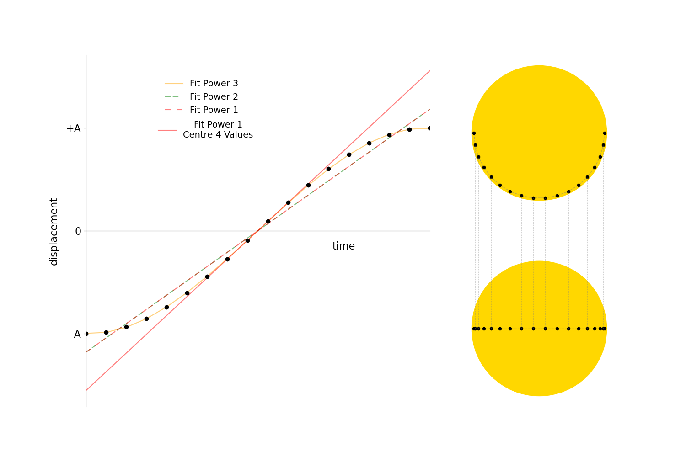

# Sunspots

## sunspots.ipynb
## AIM - To measure the Suns rotation period using sunspots and visualise our results

**Predict**

Have a think about these questions and make some predictions! Be sure to tell someone else what you predict.

1) How fast do you think the Sun rotates?  
2) Does it rotate at the same speed all over its surface?  
3) How could we use sunpots in a series of images to calculate the Suns rotation period?

## theorySunspots.ipynb
## AIM - To visualise and describe the motion of a sunspot

## Intro

Identification of sunspots in SDO HMI continuum images.  
Calculation of the sidereal and synodic rotation periods of the Sun.  
Automatic identification and tracking of sunspots using SunPy.

**sunspots.ipynb** will let students calculate the rotation period of the Sun using interactive SDO images.

**sun.yml** is a basic env setup that I used to test the code.

**theorySunspots.ipynb** explores some of the theory/maths behind the sunspots motion. The non-interactive **theorySunspots.py** creates the figures prefixed with ***theory*** in the ***figures*** directory.

All the SDO HMI images are in the ***images*** directory (after 1st run of code).  
The ***data*** directory contains data from **sunspotsAuto.py**.  
Figures (gifs, pngs etc) are stored in the ***figures*** directory.

## NOTE

The **.py** files, including the one to automatically track sunspots, are no longer maintained so will not receive any fixes or updates. There are old Plotly versions of these notebooks that are also no longer maintained.

**sunspotsAuto.py** lets you automatically identify sunspots in an image using **stara.py** (from [Cadair](https://github.com/Cadair/sunspot_experiments/blob/master/stara.py)) and also create tracks/paths  of the sunspots over time and uses the tracks to calcualte the sideral rotation period at different latitudes.

Gif of sunspots identified with **sunspotsAuto.py** and **stara.py**. Sunspot centers (stars) are identified using ***scikit-learn*** DBS Clustering. Notice how the sunspot can appear in one image and dissapear in the next as identified by scikit-learn - perhaps a better clustering algorithim could be used? (hierachical/agglomarate clustering?)

Final output of **sunspotsAuto.py**, each point is a possible sunspot track. Colours are based on the max residual value from the fits plotted. This run was with a pretty wide positional cut and high max residual cut.

Figure created by **theorySunspots.py**.

